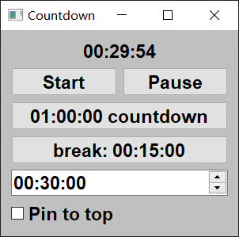

## Countdown
This program implements a simple countdown timer that runs in the system tray.

After closing the window, the program still runs, you can right click "Open main window" on the system status bar to open the countdown timer window again

In addition, by modifying the path in the run.bat file, you can easily run the python script in the background of windows platform 
## read more
This program has the following functions:

- Can pin window on top
- The user can set the countdown time by editing. 
- Triggers a notification at the end of the countdown When the time remaining is zero, the timer stops and a notification is triggered. 
- displays the remaining time in hours, minutes and seconds format
- When the user clicks the “xx:xx:xx countdown” button or "break:00:15:00"button,  the timer is reset to xx:xx:xx  and the countdown begins immediately. 
- Finally, the program displays an icon in the system tray with a menu containing options such as 'Start','Pause',"Quit" and so on.